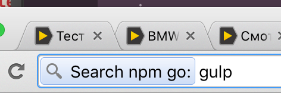

#  npm-api.io
Npm Api Service

## Usage

`GET /p/:package` e.g. [`GET /p/gulp`](http://npmapi.invntrm.ru/p/gulp)
retrieves gulp's github url.

`GET /go/:package` e.g. [`GET /go/enb`](http://npmapi.invntrm.ru/go/enb)
redirects to enb's github repo page.

## For what
### Alfred: fast opener github repo for npm package
Use it with your **Alfred** app for fast opening npm-packages' git repos.

**💡Tip** Grab an icon for the Alfred by url: [npmapi.invntrm.ru/favicon.png](http://npmapi.invntrm.ru/favicon.png)

### Chrome: custom search github repo for npm package
Use it in Chrome, Opera, Yandex.browser and another Chromium based bro as custom search.

Type into Chrome [omnibox](http://www.makeuseof.com/tag/11-quick-tricks-to-become-a-chrome-omnibox-power-user/) (address bar): `ng`, then press `space` or `tab`, then input package name and press `enter`.

**💡Tip** Use as search url: `http://npmapi.invntrm.ru/%s`

## TODO
* `/git/` — url for git
* `/v/` — version
* `/i/` — info (human readable package.json view)
