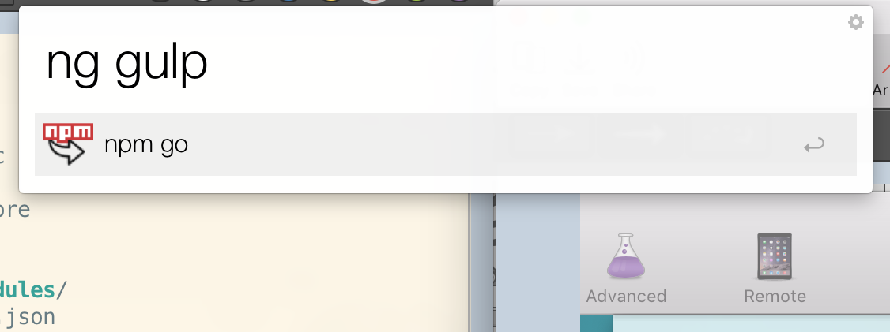

#  npm-api.io
Npm Api Service

## Usage

`GET /p/:package` e.g. `GET /p/gulp`
retreives gulp's github url.

`GET /go/:package` e.g. `GET /go/enb`
redirects to enb's github repo page.

## For what
Use it with your **Alfred** app for fast opening npm-packages' git repos

**💡Tip** Grab an icon for the Alfred by url: [npm-api.herokuapp.com/favicon.png](http://npm-api.herokuapp.com/favicon.png)
